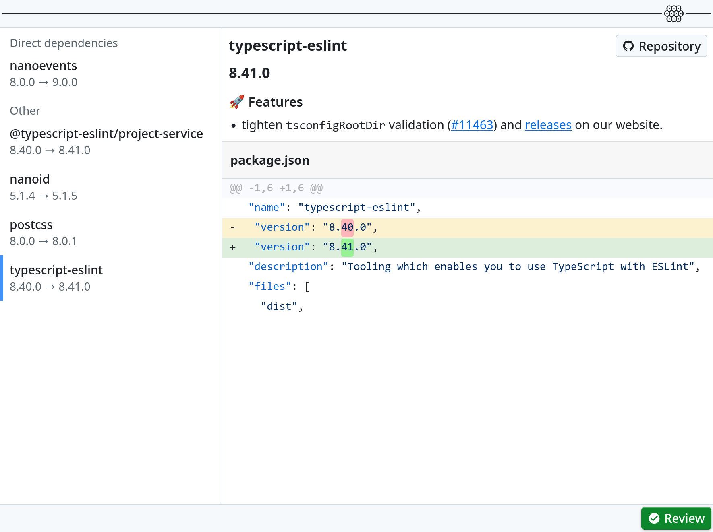

# ꙮ Multiocular

<picture >
  <source media="(prefers-color-scheme: dark)" srcset="./images/logo-dark.png">
  <source media="(prefers-color-scheme: light)" srcset="./images/logo-light.png">
  
</picture>

A Node.js tool to **review dependencies** changes to:

- Prevent **supply chain attack**.
- Catch **API breaking changes**.
- **Learn** from your dependencies.

In general, it adds **open dependencies** practice to your project and stop treating node_modules as a black box.

It supports: `npm`, `pnpm`, `yarn 1`, `yarn berry`, GitHub Actions.

<picture>
  <source media="(prefers-color-scheme: dark)" srcset="./images/screenshot-dark.png">
  <source media="(prefers-color-scheme: light)" srcset="./images/screenshot-light.png">
  
</picture>

---

  Built by
<b><a href="https://evilmartians.com/devtools?utm_source=postcss&utm_campaign=devtools-button&utm_medium=github">Evil Martians</a></b>, go-to agency for <b>developer tools</b>.

---

## Usage

First, reduce risk of exposing system to malware during the update.

Disable `postinstall` for npm:

```sh
npm config set ignore-scripts true
# We also recommend switching to pnpm where postinstall is disabled by default
```

It is also recommended of using [Dev Container](https://code.visualstudio.com/docs/devcontainers/containers) or at least run shell in container.

Install Multiocular:

```sh
npm install multiocular
# pnpm install multiocular
```

Update dependencies

```sh
# For npm
npx npm-check-updates
npm update

# For pnpm
pnpm update-interactive --latest
pnpm update

# For GitHub Actions
npx actions-up
```

Start web UI to review changes:

```sh
npx multiocular
```

## Motivation

Current practice of treating dependencies and free **black boxes** is creating a lot of issues in our industries.

For instance, **Supply chain attack** when malware added to dependencies by stealing maintainer account. Recent, [`chalk`/`debug`](https://www.aikido.dev/blog/npm-debug-and-chalk-packages-compromised), [`nx`](https://www.aikido.dev/blog/popular-nx-packages-compromised-on-npm), and [GitHub Actions](https://www.wiz.io/blog/github-action-tj-actions-changed-files-supply-chain-attack-cve-2025-30066) examples are showing that it is just beginning.

We suggest another **open dependencies** model, when team should track dependencies. It means less dependencies and more attention to it. But this is the only solution we see.
